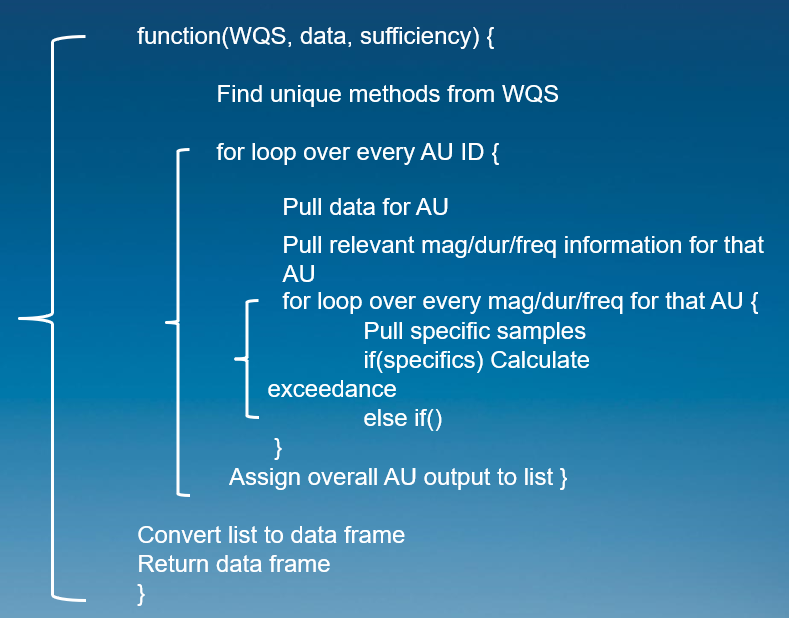

```{r, include = FALSE}
knitr::opts_chunk$set(
  collapse = TRUE,
  comment = "#>"
)
```

```{r setup, inlcude = FALSE}
library(AKDECtools)
```

# Introduction

The following vignette is associated with the [*AKDECtools*](https://github.com/Blocktt/AKDECtools) R package developed by Tetra Tech for the Alaska Department of Environmental Conservation (AK DEC). This vignette assumes that the user has relatively recent versions of [R](https://www.r-project.org/) and [RStudio](https://posit.co/download/rstudio-desktop/) installed and that they are familiar with the R coding language. Please direct any questions regarding the usage of the *AKDECtools* R package to Amber Bethe Crawford, AK DEC (amber.crawford\@alaska.gov).

## Purpose

The *AKDECtools* package has many functions that are useful to AK DEC staff. Some functions are designed to manipulate data, others to evaluate water quality standards, and some are used for data visualization. Simply run `help(package = "AKDECtools")` to access the list of the package's functions. Each function is explained in detail below with examples.

# Installing AKDECtools

*AKDECtools* can be downloaded from Ben Block's GitHub repository using the following R code. Note, if you want to download this vignette with the package, use the second function that includes the vignette argument.

```{r, eval = FALSE}
# install.packages("devtools") # install devtools if necessary
devtools::install_github("Blocktt/AKDECtools")

# run the following to download vignette with the package
devtools::install_github("Blocktt/AKDECtools", build_vignettes = TRUE)
```

# Data sources

*AKDECtools* functions require multiple input tables to run properly. For AK DEC staff users, run raw Water Quality Portal (WQP) data through the [*data_processing.R*](https://github.com/KateriSalk/Alaska_IR_Automation/blob/main/Code/5_Data_Processing/data_processing.R) script before running these functions. Specifically, you will want to use two outputs from that script:

-   "WQ_data_trimmed_long_withAU_YYYYMMDD.csv" (where YYYYMMDD is the date when the file was generated). This file should contain all water quality data with the necessary fields such as TADA.CharacteristicName and AUID_ATTNS (see table below for required fields for each function).

-   "WQ_metadata_trimmed_with_data_sufficiency_YYYYMMDD.csv" (where YYYYMMDD is the date when the file was generated). This file should contain data sufficiency metadata for each AU/characteristic combination.

Lastly, multiple *AKDECtools* functions utilize a water quality standards (WQS) crosswalk table to evaluate water quality data against the Alaska WQS. The crosswalk table was developed by AK DEC and Tetra Tech and represents all unique combinations of magnitude, duration, and frequency (MagDurFreq) rules. For more information, see [Alaska's Water Quality Standards](https://dec.alaska.gov/media/5xcm2h5i/18-aac-70-nov-2022.pdf) and [Alaska's Water Quality Manual for Toxics and other Deleterious Organic and Inorganic Substances](https://dec.alaska.gov/media/q5njdzbc/alaska-water-quality-criteria-manual-for-toxic-and-other-deleterious-organic-and-inorganic-substances-2022.pdf). A version of this tables is stored in the *AKDECtools* package and can either be manually downloaded from [GitHub](https://raw.githubusercontent.com/Blocktt/AKDECtools/main/inst/extdata/AK_WQS_Crosswalk.csv) or imported into R using the code below. This table will need to be updated to match any changes AK DEC makes to their WQS.

```{r, eval = FALSE}
# Load crosswalk tables using the code below:
df_WQS_Crosswalk <- read_csv(system.file("extdata /AK_WQS_Crosswalk.csv", package = "AKDECtools")
                             , guess_max = 10^6)
```

## Example files

We have provided examples of each input file necessary to run the functions. They can be loaded into the R environment using the code below. The table below shows all the package functions, corresponding arguments and example tables, and the required fields from each table. More details on each function can be found in the subsequent sections.

```{r, eval = FALSE}
# Load example tables using the code below
df_ExampSamps <- read_csv(system.file("extdata /AK_Example_Samples.csv", package = "AKDECtools")
                             , guess_max = 10^6)

## NOTE: Both examples are in the extdata folder. Here are their csv file names:
# AK_Data_Sufficiency.csv
# AK_Example_Samples.csv
# AK_Final_MagDurFreq_Output.csv
```

| Function                    | Argument               | Example Table           | Required Fields                                                                                                                                   |
|---------------|---------------|---------------|----------------------------|
| simplePull                  | data                   | df_ExampSamps           | TADA.CharacteristicName, AUID_ATTNS                                                                                                               |
| simplePull                  | AU_ID                  | *User specified*        | *NA*                                                                                                                                              |
| simplePull                  | constituent            | *User specified*        | *NA*                                                                                                                                              |
| filterCat3samples           | data_samples           | df_ExampSamps           | AUID_ATTNS, TADA.CharacteristicName, TADA.ResultMeasureValue                                                                                      |
| filterCat3samples           | data_sufficiency       | df_Data_Sufficiency     | Data_Sufficient, AUID_ATTNS, TADA.CharacteristicName                                                                                              |
| MagDurFreq                  | wqs_crosswalk          | df_WQS_Crosswalk        | Constituent, Directionality, Frequency, Duration, Details, Use, Waterbody Type, Magnitude_Text, Magnitude_Numeric                                 |
| MagDurFreq                  | input_samples_filtered | *Use filterCat3samples* | AUID_ATTNS, ActivityStartDate, AU_Type, ActivityStartTime.Time, TADA.ResultMeasureValue, TADA.ActivityDepthHeightMeasure.MeasureValue             |
| MagDurFreq                  | input_sufficiency      | df_Data_Sufficiency     | AUID_ATTNS, TADA.CharacteristicName, Use, Waterbody Type, Fraction, Type                                                                          |
| MagDurFreq_hardness         | wqs_crosswalk          | df_WQS_Crosswalk        | Constituent, Directionality, Frequency, Duration, Details, Use, Waterbody Type, Magnitude_Text, Magnitude_Numeric                                 |
| MagDurFreq_hardness         | input_samples          | df_ExampSamps           | AUID_ATTNS, TADA.CharacteristicName, ActivityStartDate, ActivityStartTime.Time                                                                    |
| MagDurFreq_hardness         | input_samples_filtered | *Use filterCat3samples* | AUID_ATTNS, ActivityStartDate, AU_Type, ActivityStartTime.Time, TADA.ResultMeasureValue                                                           |
| MagDurFreq_hardness         | input_sufficiency      | df_Data_Sufficiency     | AUID_ATTNS, TADA.CharacteristicName, Use, Waterbody Type, Fraction, Type                                                                          |
| freshwaterAmmoniaWarning    | input_sufficiency      | df_Data_Sufficiency     | TADA.CharacteristicName, Waterbody Type, Data_Sufficient                                                                                          |
| MagDurFreq_pH               | wqs_crosswalk          | df_WQS_Crosswalk        | Constituent, Directionality, Frequency, Duration, Details, Use, Waterbody Type, Magnitude_Text, Magnitude_Numeric                                 |
| MagDurFreq_pH               | input_samples          | df_ExampSamps           | AUID_ATTNS, TADA.CharacteristicName, ActivityStartDate, ActivityStartTime.Time                                                                    |
| MagDurFreq_pH               | input_samples_filtered | *Use filterCat3samples* | AUID_ATTNS, ActivityStartDate, AU_Type, ActivityStartTime.Time, TADA.ResultMeasureValue                                                           |
| MagDurFreq_pH               | input_sufficiency      | df_Data_Sufficiency     | AUID_ATTNS, TADA.CharacteristicName, Use, Waterbody Type, Fraction, Type                                                                          |
| findTurbidityReferenceSites | input_samples_filtered | df_ExampSamps           | TADA.CharacteristicName, AUID_ATTNS, MonitoringLocationIdentifier                                                                                 |
| MagDurFreq_turbidity        | wqs_crosswalk          | df_WQS_Crosswalk        | Constituent, Directionality, Frequency, Duration, Details, Use, Waterbody Type, Magnitude_Text, Magnitude_Numeric                                 |
| MagDurFreq_turbidity        | input_samples_filtered | *Use filterCat3samples* | AUID_ATTNS, ActivityStartDate, AU_Type, ActivityStartTime.Time, TADA.ResultMeasureValue                                                           |
| MagDurFreq_turbidity        | input_sufficiency      | df_Data_Sufficiency     | AUID_ATTNS, TADA.CharacteristicName, Use, Waterbody Type, Fraction, Type                                                                          |
| MagDurFreq_turbidity        | reference_sites        | *NA*                    | AUID_ATTNS, ReferenceSites                                                                                                                        |
| MagDurFreq_combine          | standard_output        | *NA*                    | *Output from MagDurFreq*                                                                                                                          |
| MagDurFreq_combine          | hardness_output        | *NA*                    | *Output from MagDurFreq_hardness*                                                                                                                 |
| MagDurFreq_combine          | pH_output              | *NA*                    | *Output from MagDurFreq_pH*                                                                                                                       |
| MagDurFreq_combine          | turbidity_output       | *NA*                    | *Output from MagDurFreq_turbidity*                                                                                                                |
| categorize_AU               | MagDurFreq_Results     | *NA*                    | *Output from MagDurFreq_combine*                                                                                                                  |
| boxPlot                     | data                   | df_ExampSamps           | TADA.CharacteristicName, AUID_ATTNS, TADA.ResultMeasureValue, MonitoringLocationIdentifier, TADA.ResultMeasure.MeasureUnitCode                    |
| boxPlot                     | WQS_table              | df_WQS_Crosswalk        | TADA.Constituent                                                                                                                                  |
| boxPlot                     | AU_ID                  | *User specified*        | *NA*                                                                                                                                              |
| boxPlot                     | y_axis_log             | *User specified*        | *TRUE/FALSE*                                                                                                                                      |
| timeSeries                  | data                   | df_ExampSamps           | TADA.CharacteristicName, AUID_ATTNS, ActivityStartDate, TADA.ResultMeasureValue, MonitoringLocationIdentifier, TADA.ResultMeasure.MeasureUnitCode |
| timeSeries                  | WQS_table              | df_WQS_Crosswalk        | TADA.Constituent                                                                                                                                  |
| timeSeries                  | AU_ID                  | *User specified*        | *NA*                                                                                                                                              |
| timeSeries                  | y_axis_log             | *User specified*        | *TRUE/FALSE*                                                                                                                                      |

# Data manipulation functions

## simplePull

The *simplePull* function is intended to filter specific data from a larger WQ dataset by either an assessment unit identifier (AU_ID), water quality constituent (TADA.CharacteristicName), or both. Multiple values can be entered into either argument. See function documentation by running `?AKDECtools::simplePull`.

Below are examples on how to use *simplePull* depending on whether a user wants to filter the input dataset by one or more AU_ID(s) and/or one or more constituent(s).

```{r, eval=FALSE}
# Load packages
library(readr) # readr is a tidyverse package to read CSVs
library(AKDECtools)

# Import the example file from the AKDECtools package
df_ExampSamps <- read_csv(system.file("extdata/AK_Example_Samples.csv", package = "AKDECtools")
                          , guess_max = 10^6)

#~~~~~~~~~~~~~~~~~~~~~~~~~~~~~~~~~~~~~~~~~~~~~~~~~~~~~~~~~~~
# Example 1 - single AU and single constituent

test_pull <- simplePull(data = df_ExampSamps, AU_ID = c('AK_R_1010504_005')
                        , constituent = c('PH'))

#~~~~~~~~~~~~~~~~~~~~~~~~~~~~~~~~~~~~~~~~~~~~~~~~~~~~~~~~~~~
# Example 2 - multiple AUs and single constituent

test_pull <- simplePull(data = df_ExampSamps, AU_ID = c('AK_R_1010504_005', 'AK_B_1010203_001')
                        , constituent = c('TEMPERATURE, WATER'))

#~~~~~~~~~~~~~~~~~~~~~~~~~~~~~~~~~~~~~~~~~~~~~~~~~~~~~~~~~~~
# Example 3 - single AU and multiple constituents

test_pull <- simplePull(data = df_ExampSamps, AU_ID = c('AK_R_1010504_005')
                        , constituent = c('PH', 'TEMPERATURE, WATER'))

#~~~~~~~~~~~~~~~~~~~~~~~~~~~~~~~~~~~~~~~~~~~~~~~~~~~~~~~~~~~
# Example 4 - multiple AUs and multiple constituents

test_pull <- simplePull(data = df_ExampSamps, AU_ID = c('AK_R_1010504_005', 'AK_B_1010203_001')
                        , constituent = c('PH', 'TEMPERATURE, WATER'))

#~~~~~~~~~~~~~~~~~~~~~~~~~~~~~~~~~~~~~~~~~~~~~~~~~~~~~~~~~~~
# Evaluate unique results in test_pull using the following code
unique(test_pull$AUID_ATTNS) # returns unique AU_IDs in trimmed dataset
unique(test_pull$TADA.CharacteristicName) # returns unqiue TADA.CharacteristicNames in trimmed dataset
```

Here is an example output

```{r, eval = TRUE}
# Load packages
library(readr) # readr is a tidyverse package to read CSVs
library(AKDECtools)
library(knitr) # for table
library(kableExtra) # for table

# Import the example file from the AKDECtools package
df_ExampSamps <- suppressMessages(read_csv(system.file("extdata/AK_Example_Samples.csv"
                                                       , package = "AKDECtools"), guess_max = 10^6))

#~~~~~~~~~~~~~~~~~~~~~~~~~~~~~~~~~~~~~~~~~~~~~~~~~~~~~~~~~~~
# Example 1 - single AU and single constituent

test_pull <- simplePull(data = df_ExampSamps, AU_ID = c('AK_R_1010504_005')
                        , constituent = c('PH'))

# show trimmed results
test_pull_v2 <- head(test_pull) %>% 
  dplyr::select(MonitoringLocationIdentifier
                , AUID_ATTNS, ActivityStartDate
                , TADA.CharacteristicName
                , TADA.ResultMeasureValue)

options(knitr.kable.NA = '')
test_pull_v2 %>%
  knitr::kable() %>%
  kableExtra::kable_styling(full_width = F, position = "left", font_size = 12)

```

# Water quality standards functions

The following set of functions are intended to be used in sequence to process data that are output from [*data_processing.R*](https://github.com/KateriSalk/Alaska_IR_Automation/blob/main/Code/5_Data_Processing/data_processing.R). The end results will be exceedance determinations and IR category assignments for each AU/characteristic combination and overall IR category assignments for each AU.

## filterCat3samples

The *filterCat3samples* function filters the water quality data sufficiency output from *data_processing.R* to only include the AU/characteristic combinations that are sufficient (Data_Sufficient == 'Yes'). The water quality data associated with those combinations are then filtered to be used in subsequent functions (referred to as 'input_samples_filtered' in functions below). See function documentation by running `?AKDECtools::filterCat3samples`.

Here is an example of the *filterCat3samples* function.

```{r, eval=FALSE}
# Load packages
library(readr) # readr is a tidyverse package to read CSVs
library(AKDECtools)

# Import the example file from the AKDECtools package
df_ExampSamps <- read_csv(system.file("extdata/AK_Example_Samples.csv", package = "AKDECtools")
                          , guess_max = 10^6)

df_Data_Sufficiency <- read_csv(system.file("extdata/AK_Data_Sufficiency.csv", package = "AKDECtools")
                                , guess_max = 10^6)

#~~~~~~~~~~~~~~~~~~~~~~~~~~~~~~~~~~~~~~~~~~~~~~~~~~~~~~~~~~~
# Example
input_samples_filtered <- filterCat3samples(data_samples = df_ExampSamps
                                            , data_sufficiency = df_Data_Sufficiency)
```

## MagDurFreq

The following are a set of functions that evaluate input water quality data, filtered using *filterCat3samples,* against Alaska's surface water quality standards (WQS) as summarized in the WQS crosswalk table. The functions include:

-   **MagDurFreq**: Applies water quality standards for all characteristics that are not hardness- or pH- dependent, or turbidity.

-   **MagDurFreq_hardness**: Applies hardness-dependent water quality standards.

-   **MagDurFreq_pH**: Applies pH-dependent water quality standards.

-   **MagDurFreq_turbidity**: Applies turbidity water quality standards.

-   **MagDurFreq_combine**: Combines results from all four MagDurFreq functions above.

Each MagDurFreqfunction is described in detail in the following sections.

### Standard Output

The *MagDurFreq* function applies water quality standards for all characteristics that are not turbidity or hardness- or pH-dependent. Inputs include the data sufficiency results from *data_processing.R*, the data-sufficient water quality data generated using *filterCat3samples*, and the WQS crosswalk table. See function documentation by running `?AKDECtools::MagDurFreq`.

See below for an example of the *MagDurFreq* function.

```{r, eval=FALSE}
#Load packages 
library(readr) # readr is a tidyverse package to read CSVs
library(AKDECtools)  # Import the example file from the AKDECtools package 

df_ExampSamps <- read_csv(system.file("extdata/AK_Example_Samples.csv", package = "AKDECtools")
                          , guess_max = 10^6)

df_Data_Sufficiency <- read_csv(system.file("extdata/AK_Data_Sufficiency.csv", package = "AKDECtools")
                                , guess_max = 10^6)

df_WQS_Crosswalk <- read_csv(system.file("extdata/AK_WQS_Crosswalk.csv"
                                         , package = "AKDECtools"), guess_max = 10^6)
#~~~~~~~~~~~~~~~~~~~~~~~~~~~~~~~~~~~~~~~~~~~~~~~~~~~~~~~~~~~
# Example 
# Filter samples to only those with sufficient data to make MagDurFreq run more quickly
input_samples_filtered <- filterCat3samples(data_samples = df_ExampSamps
                                            , data_sufficiency = df_Data_Sufficiency)

# run MagDurFreq
MagDurFreq(df_WQS_Crosswalk, input_samples_filtered, df_Data_Sufficiency)
```

Below is a generalized diagram of how the *MagDurFreq* function works. First, the function loops over every AU_ID provided in the input dataset and separates out the representative water chemistry data. Then, the relevant magnitude, duration, and frequency rules are filtered from the WQS crosswalk table depending on the water chemistry characteristics sampled within the given AU. Next, the WQS calculations are completed based on the corresponding rules and exceedances are determined. Finally, results are combined for each AU. The process repeats until all AUs are evaluated and the results are compiled. Note, that the same process occurs for the *MagDurFreq_hardness, MagDurFreq_pH,* and *MagDurFreq_turbidity* functions.

{width="485"}

### Hardness-Dependent

The *MagDurFreq_hardness* function applies water quality standards for all characteristics that are hardness-dependent. Inputs include the water quality data and data sufficiency results from *data_processing.R*, the data-sufficient water quality data generated using *filterCat3samples*, and the WQS crosswalk table. See function documentation by running `?AKDECtools::MagDurFreq_hardness`.

See below for an example of the *MagDurFreq_hardness* function.

```{r, eval=FALSE}
#Load packages 
library(readr) # readr is a tidyverse package to read CSVs
library(AKDECtools)  # Import the example file from the AKDECtools package 
df_ExampSamps <- read_csv(system.file("extdata/AK_Example_Samples.csv"
                                      , package = "AKDECtools"), guess_max = 10^6)

df_Data_Sufficiency <- read_csv(system.file("extdata/AK_Data_Sufficiency.csv"
                                            , package = "AKDECtools"), guess_max = 10^6)

df_WQS_Crosswalk <- read_csv(system.file("extdata/AK_WQS_Crosswalk.csv"
                                         , package = "AKDECtools"), guess_max = 10^6)
#~~~~~~~~~~~~~~~~~~~~~~~~~~~~~~~~~~~~~~~~~~~~~~~~~~~~~~~~~~~
# Example 
# Filter samples to only those with sufficient data to make MagDurFreq run more quickly
input_samples_filtered <- filterCat3samples(data_samples = df_ExampSamps
                                            , data_sufficiency = df_Data_Sufficiency)

# run MagDurFreq_hardness
MagDurFreq_hardness(df_WQS_Crosswalk, df_ExampSamps, input_samples_filtered, df_Data_Sufficiency)
```

### pH-Dependent

The *MagDurFreq_pH* function applies water quality standards for all characteristics that are pH-dependent. Inputs include the water quality data and data sufficiency results from *data_processing.R*, the data-sufficient water quality data generated using *filterCat3samples*, and the WQS crosswalk table. See function documentation by running `?AKDECtools::MagDurFreq_pH`.

Note, the *freshwaterAmmoniaWarning* function checks if there is sufficient freshwater ammonia data for water quality analyses. If there is sufficient data, the *MagDurFreq_pH* function can be applied. See function documentation by running `?AKDECtools::freshwaterAmmoniaWarning`.

See below for an example of the *MagDurFreq_pH* function.

```{r, eval=FALSE}
#Load packages 
library(readr) # readr is a tidyverse package to read CSVs
library(AKDECtools)  # Import the example file from the AKDECtools package 
df_ExampSamps <- read_csv(system.file("extdata/AK_Example_Samples.csv"
                                      , package = "AKDECtools"), guess_max = 10^6)

df_Data_Sufficiency <- read_csv(system.file("extdata/AK_Data_Sufficiency.csv"
                                            , package = "AKDECtools"), guess_max = 10^6)

df_WQS_Crosswalk <- read_csv(system.file("extdata/AK_WQS_Crosswalk.csv"
                                         , package = "AKDECtools"), guess_max = 10^6)
#~~~~~~~~~~~~~~~~~~~~~~~~~~~~~~~~~~~~~~~~~~~~~~~~~~~~~~~~~~~
# Example
# Filter samples to only those with sufficient data to make MagDurFreq run more quickly
input_samples_filtered <- filterCat3samples(data_samples = df_ExampSamps
                                            , data_sufficiency = df_Data_Sufficiency)

# run MagDurFreq_pH
MagDurFreq_pH(df_WQS_Crosswalk, df_ExampSamps, input_samples_filtered, df_Data_Sufficiency)
```

### Turbidity

The *MagDurFreq_turbidity* function applies turbidity water quality standards. Inputs include the turbidity water quality data and data sufficiency results from *data_processing.R*, the data-sufficient water quality data generated using *filterCat3samples*, the WQS crosswalk table, and a reference site look-up table for each AU. See function documentation by running `?AKDECtools::MagDurFreq_turbidity`.

Note, the *findTurbidityReferenceSites* function identifies which AUs have sufficient turbidity samples and returns a detailed list of monitoring locations within that AU that can be selected as a reference site for turbidity analysis. This function is not required, but should be run before *MagDurFreq_turbidity*. See function documentation by running `?AKDECtools::findTurbidityReferenceSites`.

See below for an example of the *MagDurFreq_turbidity* function.

```{r, eval=FALSE}
#Load packages 
library(readr) # readr is a tidyverse package to read CSVs
library(AKDECtools)  # Import the example file from the AKDECtools package 
df_ExampSamps <- read_csv(system.file("extdata/AK_Example_Samples.csv"
                                      , package = "AKDECtools"), guess_max = 10^6)

df_Data_Sufficiency <- read_csv(system.file("extdata/AK_Data_Sufficiency.csv"
                                            , package = "AKDECtools"), guess_max = 10^6)

df_WQS_Crosswalk <- read_csv(system.file("extdata/AK_WQS_Crosswalk.csv"
                                         , package = "AKDECtools"), guess_max = 10^6)
#~~~~~~~~~~~~~~~~~~~~~~~~~~~~~~~~~~~~~~~~~~~~~~~~~~~~~~~~~~~
# Example 
# Filter samples to only those with sufficient data to make MagDurFreq run more quickly
input_samples_filtered <- filterCat3samples(data_samples = df_ExampSamps
                                            , data_sufficiency = df_Data_Sufficiency)

# create reference table
# reference_sites <- tibble(AUID_ATTNS = au_sites, ReferenceSites = sites)

# run MagDurFreq_turbidity
MagDurFreq_turbidity(df_WQS_Crosswalk, input_samples_filtered, df_Data_Sufficiency, reference_sites)
```

### Combine

The *MagDurFreq_combine* function combines MagDurFreq results from all four MagDurFreq functions. See function documentation by running `?AKDECtools::MagDurFreq_combine`.

See below for an example of the *MagDurFreq_combine* function.

```{r, eval=FALSE}
#Load packages 
library(readr) # readr is a tidyverse package to read CSVs
library(AKDECtools)  # Import the example file from the AKDECtools package 
df_ExampSamps <- read_csv(system.file("extdata/AK_Example_Samples.csv"
                                      , package = "AKDECtools"), guess_max = 10^6)

df_Data_Sufficiency <- read_csv(system.file("extdata/AK_Data_Sufficiency.csv"
                                            , package = "AKDECtools"), guess_max = 10^6)

df_WQS_Crosswalk <- read_csv(system.file("extdata/AK_WQS_Crosswalk.csv"
                                         , package = "AKDECtools"), guess_max = 10^6)
#~~~~~~~~~~~~~~~~~~~~~~~~~~~~~~~~~~~~~~~~~~~~~~~~~~~~~~~~~~~
# Example
# Filter samples to only those with sufficient data to make MagDurFreq run more quickly

input_samples_filtered <- filterCat3samples(data_samples = df_ExampSamps
                                            , data_sufficiency = df_Data_Sufficiency)

# run MagDurFreq
standard_output <- MagDurFreq(df_WQS_Crosswalk, input_samples_filtered, df_Data_Sufficiency)

# run MagDurFreq_pH
pH_output <- MagDurFreq_pH(df_WQS_Crosswalk, df_ExampSamps, input_samples_filtered, df_Data_Sufficiency)

# run MagDurFreq_hardness
hardness_output <- MagDurFreq_hardness(df_WQS_Crosswalk, df_ExampSamps, input_samples_filtered
                                       , df_Data_Sufficiency)

# run MagDurFreq_turbidity
# df_reference_sites <- tibble(AUID_ATTNS = au_sites, ReferenceSites = sites)

turbidity_output <- MagDurFreq_turbidity(df_WQS_Crosswalk, input_samples_filtered, df_Data_Sufficiency
                                         , df_reference_sites)

# combine data
MagDurFreq_combine(standard_output, pH_output, hardness_output, turbidity_output)

```

## Categorize AUs by Use

The *categorize_AU_uses* function can be applied to water quality data output from the *MagDurFreq_combine* function. First, the MagDurFreq results are assigned to IR categories for each AU/characteristic combination. Then, each AU is assigned to an overall IR category per designated use. See function documentation by running `?AKDECtools::categorize_AU_uses`.

See below for an example of the *categorize_AU_uses* function.

```{r, eval=FALSE}
#Load packages 
library(readr) # readr is a tidyverse package to read CSVs
library(AKDECtools)  # Import the example file from the AKDECtools package

# example final results from MagDurFreq_combine function
df_MagDurFreq_Results <- read_csv(system.file("extdata/AK_Final_MagDurFreq_Output.csv"
                                              , package = "AKDECtools"), guess_max = 10^6)

#~~~~~~~~~~~~~~~~~~~~~~~~~~~~~~~~~~~~~~~~~~~~~~~~~~~~~~~~~~~
# Example 1
uses_categorized <- categorize_AU_uses(df_MagDurFreq_Results, simplify_standards = F)
```

**Individual categories (for each AU/characteristic combination)**:

| Rule                                    | Explanation                                                                                                      | IR Category |
|-----------------|--------------------------------------|-----------------|
| Exceed == "No"                          | Any AU/characteristic combination, with sufficient data, that does not exceed water quality standards (WQS)      | 2           |
| Data_Sufficient == "No"                 | Any AU/characteristic combination with insufficient data                                                         | 3           |
| Exceed == "Insufficient hardness"       | Any AU/characteristic combination, with sufficient data, that lacks sufficient hardness data to apply WQS        | 3           |
| Exceed == "Insufficient dependent data" | Any AU/characteristic combination, with sufficient data, that lacks sufficient pH or turbidity data to apply WQS | 3           |
| Exceed == "Yes"                         | Any AU/characteristic combination, with sufficient data, that exceeds water quality standards (WQS)              | 5           |

**Overall designated use categories (for each AU/use combination)**:

| Rule                                    | Explanation                                                                                      | IR Category |
|------------------|-------------------------------------|------------------|
| cat_5_present == 0 & cat_2_present == 0 | Of the Individual Category results, there are none in Category 2 or Category 5                   | 3           |
| cat_5_present == 0 & cat_2_present \> 0 | Of the Individual Category results, there are none in Category 5, but at least one in Category 2 | 2           |
| cat_5_present \> 0                      | Of the Individual Category results, there is at least one in Category 5                          | 5           |

## Categorize AUs Overall

The *categorize_AU* function takes in the output of the *categorize_AU_uses* function to then assign an overall AU IR category of 2, 3, or 5. Separating the overall AU and AU by use categorization allows for analyst intervention to ensure that the use categories are aligned with AK DEC's work flow. See function documentation by running `?AKDECtools::categorize_AU`.

See below for an example of the *categorize_AU* function.

```{r, eval=FALSE}
#Load packages 
library(readr) # readr is a tidyverse package to read CSVs
library(AKDECtools)  # Import the example file from the AKDECtools package

# example final results from MagDurFreq_combine function
df_MagDurFreq_Results <- read_csv(system.file("extdata/AK_Final_MagDurFreq_Output.csv"
                                              , package = "AKDECtools"), guess_max = 10^6)

#~~~~~~~~~~~~~~~~~~~~~~~~~~~~~~~~~~~~~~~~~~~~~~~~~~~~~~~~~~~
# Example 1
uses_categorized <- categorize_AU_uses(df_MagDurFreq_Results, simplify_standards = F)

categorize_AU(uses_categorized)
```

# Graphing functions

## boxPlot

The *boxPlot* function produces boxplots for WQ data depending on an assessment unit identifier (AU_ID). Each water quality constituent (TADA.CharacteristicName) is plotted separately. You can also decide whether to have the y-axis be Log10-scaled. See function documentation by running `?AKDECtools::boxPlot`.

Below is an example of how to use *boxPlot*.

```{r, eval=FALSE}
# Load packages
library(readr) # readr is a tidyverse package to read CSVs
library(AKDECtools)

# Import the example files from the AKDECtools package
df_ExampSamps <- read_csv(system.file("extdata/AK_Example_Samples.csv", package = "AKDECtools")
                          , guess_max = 10^6)

df_WQS_Crosswalk <- read_csv(system.file("extdata/AK_WQS_Crosswalk.csv", package = "AKDECtools")
                             , guess_max = 10^6)

#~~~~~~~~~~~~~~~~~~~~~~~~~~~~~~~~~~~~~~~~~~~~~~~~~~~~~~~~~~~
# Example 1 - single AU and single constituent

boxPlot(data = df_ExampSamps, WQS_table = df_WQS_Crosswalk
        , AU_ID = c('AK_R_1010504_005'), y_axis_log = FALSE)
#~~~~~~~~~~~~~~~~~~~~~~~~~~~~~~~~~~~~~~~~~~~~~~~~~~~~~~~~~~~
```

Below is an example *boxPlot* output.

```{r, eval = TRUE, fig.width=5, out.width="100%", echo=FALSE}
# Load packages
library(readr) # readr is a tidyverse package to read CSVs
library(AKDECtools)

# Import the example files from the AKDECtools package
df_ExampSamps <- suppressMessages(read_csv(system.file("extdata/AK_Example_Samples.csv", package = "AKDECtools")
                          , guess_max = 10^6))

df_WQS_Crosswalk <- suppressMessages(read_csv(system.file("extdata/AK_WQS_Crosswalk.csv", package = "AKDECtools")
                             , guess_max = 10^6))

#~~~~~~~~~~~~~~~~~~~~~~~~~~~~~~~~~~~~~~~~~~~~~~~~~~~~~~~~~~~
# Example 1 - single AU and single constituent

Results_list <- boxPlot(data = df_ExampSamps, WQS_table = df_WQS_Crosswalk
        , AU_ID = c('AK_R_1010504_005'), y_axis_log = FALSE)

Results_list[[1]]
#~~~~~~~~~~~~~~~~~~~~~~~~~~~~~~~~~~~~~~~~~~~~~~~~~~~~~~~~~~~
```

## timeSeries

The *timeSeries* function produces time series plots for WQ data depending on an assessment unit identifier (AU_ID). Each water quality constituent (TADA.CharacteristicName) is plotted separately. You can also decide whether to have the y-axis be Log10-scaled. See function documentation by running `?AKDECtools::timeSeries`.

Below is an example of how to use *timeSeries*.

```{r, eval=FALSE}
# Load packages
library(readr) # readr is a tidyverse package to read CSVs
library(AKDECtools)

# Import the example file from the AKDECtools package
df_ExampSamps <- read_csv(system.file("extdata/AK_Example_Samples.csv", package = "AKDECtools")
                          , guess_max = 10^6)

df_WQS_Crosswalk <- read_csv(system.file("extdata/AK_WQS_Crosswalk.csv", package = "AKDECtools")
                             , guess_max = 10^6)
#~~~~~~~~~~~~~~~~~~~~~~~~~~~~~~~~~~~~~~~~~~~~~~~~~~~~~~~~~~~
# Example 1
timeSeries(data = df_ExampSamps, WQS_table = df_WQS_Crosswalk
           , AU_ID = c('AK_R_1010504_005'), y_axis_log = F)

#~~~~~~~~~~~~~~~~~~~~~~~~~~~~~~~~~~~~~~~~~~~~~~~~~~~~~~~~~~~
```

Below is an example *timeSeries* output.

```{r, eval = TRUE, fig.width=5, out.width="100%", echo=FALSE}
# Load packages
library(readr) # readr is a tidyverse package to read CSVs
library(AKDECtools)

# Import the example files from the AKDECtools package
df_ExampSamps <- suppressMessages(read_csv(system.file("extdata/AK_Example_Samples.csv", package = "AKDECtools")
                          , guess_max = 10^6))

df_WQS_Crosswalk <- suppressMessages(read_csv(system.file("extdata/AK_WQS_Crosswalk.csv", package = "AKDECtools")
                             , guess_max = 10^6))

#~~~~~~~~~~~~~~~~~~~~~~~~~~~~~~~~~~~~~~~~~~~~~~~~~~~~~~~~~~~
# Example 1 - single AU and single constituent

Results_list <- timeSeries(data = df_ExampSamps, WQS_table = df_WQS_Crosswalk
           , AU_ID = c('AK_R_1010504_005'), y_axis_log = F)

Results_list[[1]]
#~~~~~~~~~~~~~~~~~~~~~~~~~~~~~~~~~~~~~~~~~~~~~~~~~~~~~~~~~~~
```
